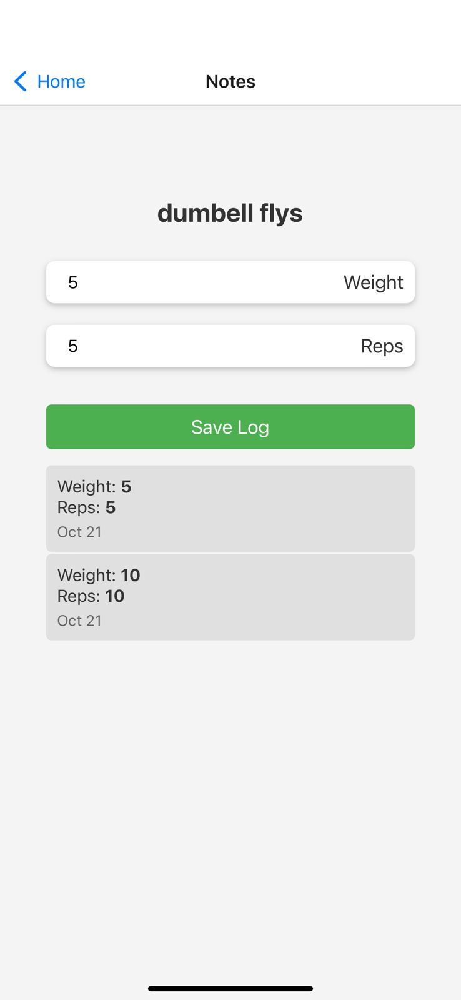
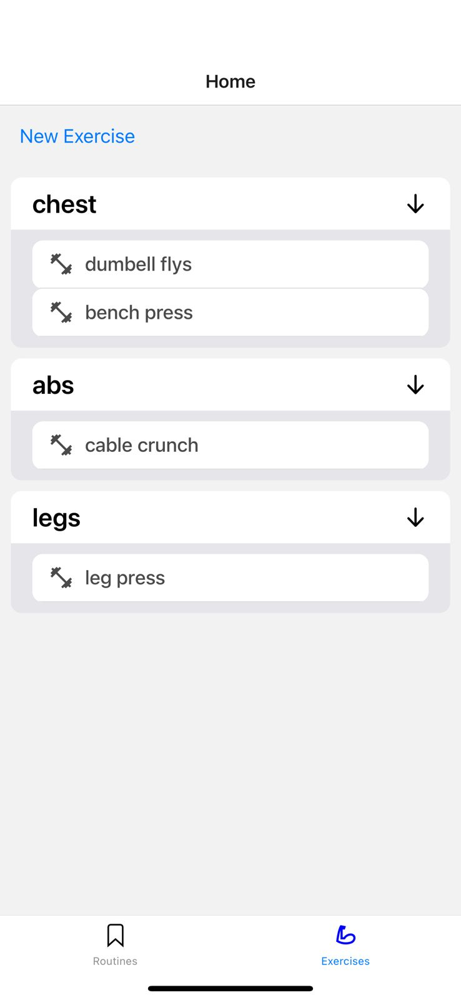
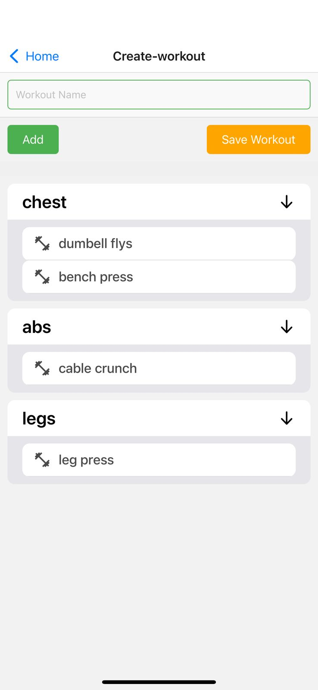

# My Fitness Notes 🏋️‍♂️

Welcome to "My Fitness Notes", your personalized fitness tracker. Built with Expo and React Native, our app integrates with Firebase for user authentication and Firestore for data storage. Track your exercises, categorize them, log your progress, and create custom workouts with ease!

## Features 🌟

- **Firebase Authentication**: Securely sign up and log in using Firebase.
- **Exercise Logging**: Keep track of your individual exercises, weights, and reps.

- **Exercise Categorization**: Organize your exercises into categories like "Chest", "Abs", "Back", and more.

- **Workout Creation**: Combine various exercises to create a custom workout for the day.

- **Data Storage with Firestore**: All your exercise and workout data is securely stored in Firestore.

## Getting Started 🚀

### Prerequisites

- Make sure you have [Node.js](https://nodejs.org/) installed.
- [Expo CLI](https://docs.expo.dev/get-started/installation/)

### Setup and Installation

1. **Clone the Repository**

   ```bash
   git clone https://github.com/your-username/my-fitness-notes.git
   cd my-fitness-notes

2. **Install Dependencies**
    ```bash
    npm install

3. **start the app**
    ```bash
    npm start

This will open up Expo in your default browser. From there, you can choose to run the app in an emulator or on a physical device using the Expo Go app.

## Firebase Setup 🔥

To make sure Firebase authentication and Firestore work correctly:

1. Set up a new project on [Firebase Console](https://console.firebase.google.com/).

2. Add your Firebase configuration to the appropriate file in the project (e.g., firebaseConfig.js). The configuration looks like:
    ```bash
    const firebaseConfig = {
    apiKey: "YOUR_API_KEY",
    authDomain: "YOUR_AUTH_DOMAIN",
    projectId: "YOUR_PROJECT_ID",
    storageBucket: "YOUR_STORAGE_BUCKET",
    messagingSenderId: "YOUR_MESSAGING_SENDER_ID",
    appId: "YOUR_APP_ID"
    };

3. Enable the desired authentication methods in the Firebase Console.


## Feedback 💬
If you have any feedback or issues, please open a GitHub issue in this repository.


